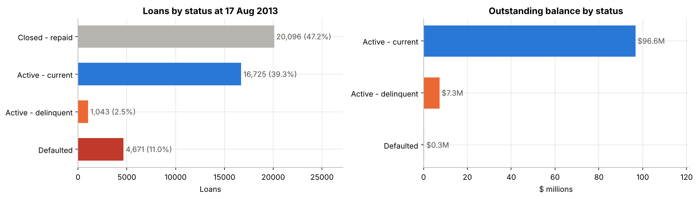
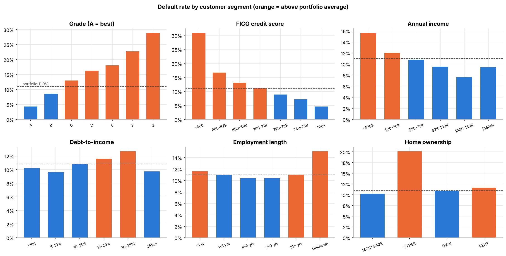
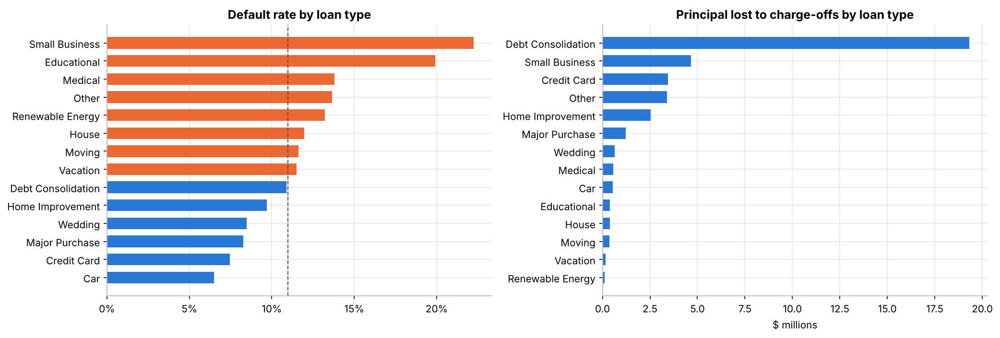
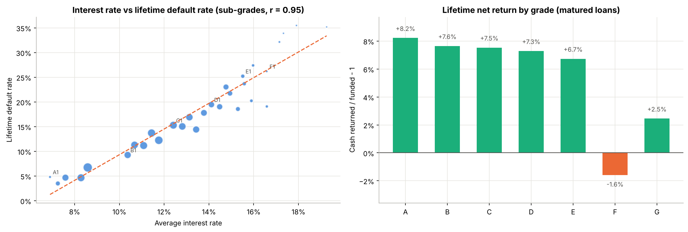
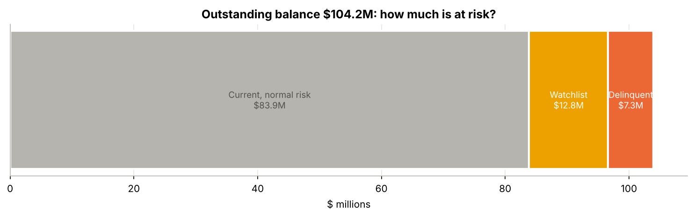
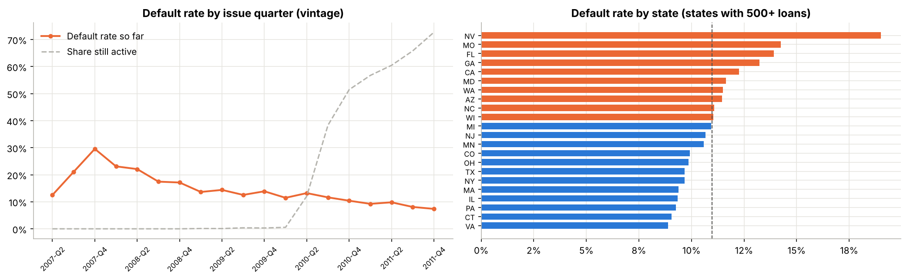
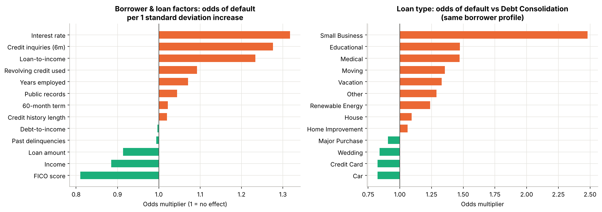

# Credit Risk & Loan Portfolio Analysis
**Data Analyst Capstone · Real LendingClub loan data · SQL · Python (incl. default-risk model) · Excel · Power BI**

## 1. Business problem
A lender wants to understand the **health of its loan portfolio**, identify **higher-risk customer segments**, and determine **where potential losses may occur**. Four questions drive the analysis:

1. Which customer groups have the highest default rate?
2. Which loan types carry the greatest risk?
3. Is a higher interest rate associated with higher default, and does the extra interest pay for it?
4. How much of the portfolio is potentially at risk?

## 2. Data — real loans
**LendingClub LoanStats3a**: **42,535 real consumer loans** issued Jun 2007 – Dec 2011 (**$460.3M** lent), with each loan's status and balance at the **snapshot date, 17 Aug 2013**. See `data/source/SOURCE.md`.

| Area | Fields used |
|---|---|
| Loan | amount, interest rate, grade A–G / sub-grade, term (36 / 60 months), purpose (loan type), issue date |
| Borrower | annual income, **FICO score**, debt-to-income, employment length, home ownership, credit inquiries, credit history, **US state** |
| Performance | status (Fully Paid, Current, In Grace Period, Late 16–30 / 31–120 days, Default, Charged Off), payments received, principal outstanding |

### Definitions
| Term | Definition |
|---|---|
| **Default** | Status *Charged Off* or *Default* |
| **Delinquent** | Active loan *In Grace Period* or *Late* (1–120 days past due) |
| **At-risk loan value** | Principal still outstanding on delinquent + defaulted loans |
| **Matured loans** | 36-month loans issued by 17 Aug 2010: full term ended before the snapshot, so the lifetime outcome is known (13,903 loans) |
| **Watchlist** | Current loans the risk model scores as high as the riskiest 10% of test loans |

### Data preparation (`scripts/01_prepare_data.py`)
| Issue found | Rows | Action |
|---|---|---|
| Text note on line 1 of the file | 1 | Skipped |
| Completely empty columns (fields added in later years) | 40 cols | Dropped |
| "Does not meet the credit policy. Status: …" prefixes | 2,749 | Prefix removed; kept and flagged `meets_credit_policy = 0` |
| Interest rate / revolving utilisation stored as text (" 10.99%") | all | Converted to numbers |
| Term stored as " 36 months" | all | Converted to 36 / 60 |
| Employment length text ("10+ years", "n/a") | 1,112 missing | Converted to years; missing = "Unknown" |
| FICO given as a range | all | Midpoint used |
| Missing / very high income (> $1M) | 4 / 15 | Kept, with care in bands |
| Home ownership "NONE" | 8 | Merged into "OTHER" |
| Duplicates | 0 | None found |

The data was then split into a **normalised SQL schema**: `loans`, `borrowers`, `loan_performance`, `loan_status_map`, `states`.

## 3. Tools and workflow
```
 SQL                               Python                                Excel                               Power BI
 5-table schema + analysis view → EDA, default drivers, rate vs   →   dashboard, segment explorer,   →   executive dashboard
 20 risk queries (CTEs, window     return, logistic regression &        loan-type / pricing / at-risk      (6 KPIs, 7 visuals),
 functions)                        gradient boosting PD model,          sheets, credit-policy simulator    DAX + field parameter
                                   at-risk layers, policy simulation
```

| Tool | Files | Highlights |
|---|---|---|
| **SQL** | `sql/01_schema.sql`, `02_views.sql`, `03_analysis_queries.sql` | Keys and indexes; a view with risk flags and segment bands; 20 queries covering amounts and rates, default and delinquency rates, segments, vintages, geography, repayment, high-risk segments, matured-loan returns |
| **Python** | `notebooks/credit_risk_analysis.ipynb` | pandas, matplotlib, scikit-learn; 24-month performance-window default model (logistic regression vs gradient boosting); lift table; scores written back to SQL |
| **Excel** | `excel/loan_portfolio_risk.xlsx` | 43,000+ live formulas; interactive **Segment Explorer** (pick any dimension); **Policy Simulator** with editable rules |
| **Power BI** | `powerbi/POWER_BI_GUIDE.md`, `data/powerbi/*.csv` | Your six KPIs and seven visuals, DAX measures, segment field parameter, map, high-risk action list, theme (Tableau notes for Mac) |

---

## 4. Executive KPIs
| Total Loan Value | Number of Loans | Default Rate | Delinquency Rate | Average Interest Rate | At-Risk Loan Value |
|---|---|---|---|---|---|
| **$460.3M** | **42,535** | **10.98%** | **5.86%** of active loans | **12.16%** | **$7.60M** (7.3% of $104.2M outstanding) |

Also: **lifetime default rate 14.3%** on matured loans · **$37.8M principal already lost** (8.2% of all money lent).



---

## 5. Findings

### Q1. Which customer groups have the highest default rate?


| Segment | Default rate | vs portfolio (11.0%) |
|---|---|---|
| FICO below 660 | **30.9%** | 2.8× |
| Grade G / F / E | **28.9% / 22.8% / 18.1%** | 2.6× / 2.1× / 1.6× |
| Loans outside credit policy | **26.5%** | 2.4× |
| 3+ credit inquiries in last 6 months | **20.1%** | 1.8× |
| FICO 660–679 | 16.7% | 1.5× |
| Income under $30K | 15.6% | 1.4× |
| *Safest:* FICO 760+ / grade A | 4.6% / 4.3% | 0.4× |

**Credit score, grade, recent credit-seeking and low income** separate good from bad borrowers. Debt-to-income, home ownership and employment length matter much less.

### Q2. Which loan types carry the greatest risk?


- **Small business loans are the riskiest: 22.2% default**, double the portfolio average. They cost **$4.7M** in principal from only 5.7% of lending. With the same borrower profile, they still have **2.5× the odds** of going bad compared with debt consolidation.
- Educational (19.9%) and medical (13.8%) follow. **Car (6.5%) and credit card refinancing (7.5%) are the safest.**
- **Debt consolidation is the largest exposure:** 53% of lending at an average 10.9% default rate, but it carries **51% of all principal lost ($19.3M) and 60% of the current at-risk balance**.
- **60-month loans** default more (13.1% vs 10.2%). They are 26% of loans but hold **67% of the outstanding balance and 70% of the at-risk value**.

### Q3. Is a higher interest rate associated with higher default?


- **Yes, very strongly.** Across sub-grades, interest rate and lifetime default rate correlate at **r = 0.95**. Lifetime default rises from **5% (grade A) to 36% (grade G)**.
- **Does the extra interest pay for the extra risk?** On matured loans, lifetime net returns are **+6.7% to +8.2% for grades A–E**, so pricing covers the risk. **Grade F loses money (−1.6%)** and grade G earns only +2.5%. The safest grade (A) earned the **highest** return.

### Q4. How much of the portfolio is potentially at risk?


| Layer | Outstanding | Share of $104.2M |
|---|---|---|
| Delinquent (1–120 days late) | $7.30M | 7.0% |
| In default (121+ days) | $0.30M | 0.3% |
| **At-risk loan value** | **$7.60M** | **7.3%** |
| Watchlist: current but high model risk (1,431 loans) | $12.78M | 12.3% |
| **Total potentially at risk** | **$20.37M** | **19.5%** |
| *Already lost to charge-offs (history)* | *$37.8M* | *8.2% of all lending* |

### Trend over time and geography


- **2007–2008 loans defaulted at 26% and 21%** (made into the financial crisis), then **13.6% (2009) and 11.6% (2010)**. The 2011 vintage shows 8.5% so far, but 65% of it is still active.
- **Nevada (19.0%), Missouri (14.3%), Florida (13.9%) and Georgia (13.2%)** have the highest default rates (states with 500+ loans). **California** holds the largest at-risk balance ($1.4M). The West is the riskiest region (12.2%) and the Northeast the safest (9.7%).

### Default-risk model (AI component)


- **Target:** "bad within 24 months of issue", the industry-standard performance window. It treats 36- and 60-month loans fairly and uses only information available at application (no leakage).
- **Logistic regression ROC-AUC 0.707**, better than **LendingClub's own grade (0.661)** and **FICO alone (0.622)**. Gradient boosting performed the same (0.703), so the simpler, explainable model was kept.
- The **riskiest 10% went bad at 25.3% vs 2.0% for the safest 10%**. The riskiest 20% of loans contain 40% of all bad loans.
- **Validated on the live book:** loans that are delinquent today score higher (12.8%) than current loans (9.8%).

### What tighter lending rules would have done (matured loans)
| Rule | Loans declined | Defaults avoided | Net return of declined loans |
|---|---|---|---|
| Decline 3+ credit inquiries | 19.4% | **33.1%** | −0.3% |
| Decline loans outside credit policy | 15.8% | 29.7% | −0.7% |
| Decline small business | 5.4% | 10.3% | **−1.8%** |
| Decline grades F–G | 3.8% | 8.9% | −0.2% |
| **Combined (F–G, 3+ inquiries, outside policy)** | **25.7%** | **43.4%** | +1.0% |

With the combined rule the **default rate falls from 14.3% to 10.9%** and the **remaining book's net return rises from 7.2% to 9.3%**. The Excel **Policy_Simulator** lets you try any combination. Its default settings (adding FICO < 660 and small business) avoid 49% of defaults while declining 29% of lending.

---

## 6. Recommendations
| # | Recommendation | Evidence | Expected impact |
|---|---|---|---|
| 1 | **Tighten approval rules:** decline 3+ recent inquiries and anything outside credit policy; stop or strictly cap grades F–G | These groups lost money over their life; together they hold 43% of defaults | Default rate 14.3% → ~10.9%; net return 7.2% → ~9.3% (with ~26% less volume) |
| 2 | **Re-price or restrict small business loans**: require business documentation or collateral and a higher rate, or exit | 22% default; −1.8% lifetime return; 2.5× odds vs debt consolidation | Removes the worst-performing loan type (5% of volume, 10% of defaults) |
| 3 | **Limit 60-month loans** to strong borrowers (grades A–C, lower loan-to-income) | 60-month loans hold 70% of the at-risk balance | Smaller tail of long-dated risky balances |
| 4 | **Concentration and affordability limits for debt consolidation:** cap loan-to-income | 53% of lending, 51% of losses, 60% of at-risk value; loan-to-income is a top risk driver | Less exposure to one product |
| 5 | **Collections now:** escalate the $7.6M delinquent/defaulted; early outreach (payment plans) for the 1,431 watchlist loans ($12.8M), ranked by risk score | Delinquent loans already score higher; early contact lowers roll-to-default | Protects up to $20.4M (19.5%) of the outstanding book |
| 6 | **Geographic monitoring:** tighter limits or pricing in NV, FL, GA; watch CA by size | Highest state default rates / largest at-risk balance | Earlier warning of regional stress |
| 7 | **Use the model as a second check** next to the grade at approval; track vintage default curves monthly and retrain quarterly | AUC 0.71 vs 0.66 for grade | Better ranking of borrowers within each grade |

---

## 7. Project structure
```
credit_risk_capstone/
├── README.md                       ← this report
├── requirements.txt
├── data/
│   ├── source/                     ← original LendingClub file (unchanged; stored as .csv.gz on GitHub) + SOURCE.md
│   ├── clean/                      ← loans, borrowers, loan_performance, loan_status_map, states, cleaning_log
│   ├── powerbi/                    ← dashboard-ready files
│   └── credit_risk.db              ← SQLite database (built by script 02; not on GitHub)
├── sql/
│   ├── 01_schema.sql · 02_views.sql · 03_analysis_queries.sql
│   └── query_results/              ← output of all 20 queries
├── notebooks/credit_risk_analysis.ipynb
├── excel/loan_portfolio_risk.xlsx
├── powerbi/POWER_BI_GUIDE.md, theme/credit_theme.json
├── images/
└── scripts/ 01_prepare_data.py · 02_build_database.py · 03_build_notebook.py (+ notebook_insights.json) · 04_build_excel.py
```

## 8. How to reproduce
```bash
pip install -r requirements.txt
python scripts/01_prepare_data.py       # check, clean and split the original file
python scripts/02_build_database.py     # SQLite database, view, 20 queries
python scripts/03_build_notebook.py     # writes the notebook
jupyter nbconvert --to notebook --execute --inplace notebooks/credit_risk_analysis.ipynb   # analysis + model (writes risk scores to the DB)
python scripts/04_build_excel.py        # Excel workbook (needs the risk scores)
```

## 9. Limitations
- Data is from 2007–2013. Credit conditions, LendingClub's policies and the economy have changed since.
- **Recoveries after charge-off are not in this file**, so losses and returns are slightly conservative.
- Recent vintages (especially 2011) are still active, so their default rates will rise. Lifetime figures use matured loans only.
- The model's 24-month target ranks risk well, but its probabilities are not calibrated lifetime PDs. The watchlist is a prioritisation tool, not a loss forecast.
- Policy simulations are retrospective: a real rule change would also change who applies.

## 10. Portfolio / résumé bullets
- Analysed **42,535 real LendingClub loans ($460M)** end-to-end with SQL, Python, Excel and Power BI to assess portfolio health, segment risk and potential losses.
- Designed a 5-table SQL schema and 20 risk queries (CTEs, window functions) covering default and delinquency rates, vintage trends, geographic and segment risk.
- Built a **default-risk model** (logistic regression, 24-month performance window, ROC-AUC 0.71 vs 0.66 for the lender's grade). Used it to flag a **$12.8M watchlist**, bringing total potentially at-risk balance to **$20.4M (19.5%)**.
- Showed that pricing covers risk for grades A–E but **grade F loses money (−1.6% lifetime)**. Simulated policy rules that would have **avoided 43% of defaults** and lifted net return from **7.2% to 9.3%**.
- Delivered an interactive Excel workbook (segment explorer, credit-policy simulator; 43K formulas) and a Power BI executive dashboard design (6 KPIs, 7 visuals, DAX).
